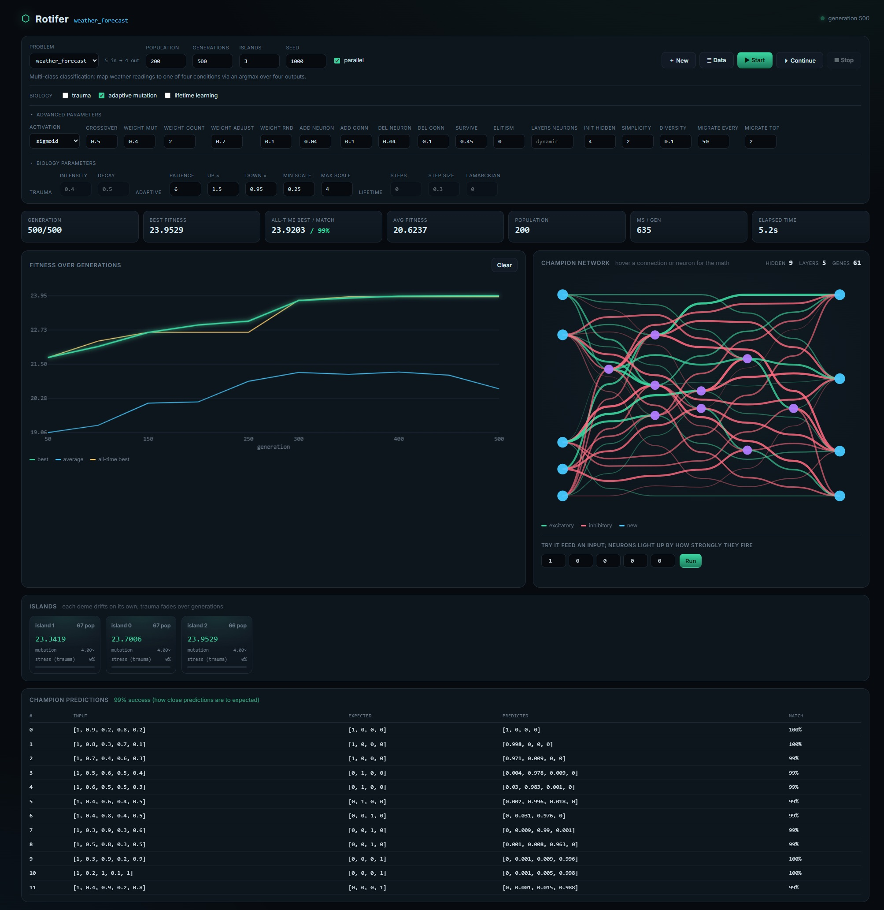
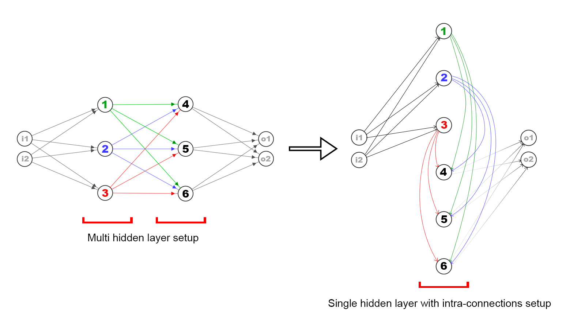

# Rotifer

**A genetic AI framework that evolves its own neural networks - modelled on how life actually evolves.**

Rotifer doesn't train networks with backpropagation. It *evolves* them: a population of organisms, each a neural network described entirely by its genome, competes and reproduces over generations. Topology, neuron count, and weights are all discovered automatically (AutoML / neuroevolution). On top of plain genetic search, Rotifer models the messy, powerful machinery of real evolution - **geographic islands, epigenetic trauma, self-tuning mutation, and lifetime learning that children inherit.**

Pure PHP. Watch it evolve live in your terminal **or** in a browser dashboard. Reproducible to the bit. Parallel across CPU cores.

```bash
composer install
php bin/rotifer serve            # start dashboard
```



---

## Why it's different

| Traditional deep learning | Rotifer |
|---|---|
| Fixed architecture you design | Architecture is **discovered** by evolution |
| Gradient descent / backprop | Genetic operators: crossover + mutation |
| One global model | A **world of islands**, each its own gene pool |
| Weights are everything | The **genome is the network** - one array of connection genes |
| A black box | **Watch every generation** evolve, in terminal or browser |

## Core ideas

- **Genome = network.** A genome is just a list of connection genes (`from → to`, weight). There are no separate weight matrices; the genome *is* the network. (`src/Genome/`)
- **Organism.** A genome compiled into a runnable `Brain` plus the things evolution cares about - fitness, age, and an `Epigenome`. (`src/Organism/`)
- **World of islands.** The `World` runs several semi-isolated `Island`s ("villages"). Each evolves on its own and periodically migrates its best individuals to neighbours - spreading breakthroughs while preserving diversity. (`src/Evolution/`)
- **One seeded RNG tree.** Every random choice flows through a seedable `Rng`; the master seed derives an independent stream per island. **Same seed ⇒ identical run**, which makes evolution testable and parallel-safe. (`src/Runtime/Rng.php`)
- **Events, not print statements.** The engine emits events; *reporters* render them - a terminal dashboard, a JSON stream for the web UI, or nothing at all. (`src/Observe/`)

Topology is dynamic by default: hidden neurons are sorted by index and edges flow low→high, so a chain of hidden neurons naturally forms multiple layers - but the same set of neurons can equally well form a single layer with intra-connections, depending on what evolution finds useful.



## The biology

Every mechanism is independently switchable in a problem's config; turned off, it's a no-op.

- **Epigenetic trauma** - hardship leaves a heritable, *decaying* stress marker that makes a lineage's offspring mutate harder for a few generations, then fades. Inherited trauma that washes out over time.
- **Adaptive mutation** - each island raises mutation when it stalls (explore) and lowers it when improving (exploit).
- **Lifetime learning** - an organism refines its own weights during its life (the Baldwin effect). A configurable fraction of what it learns is written back into its genome and **inherited** (Lamarckian).
- **Islands & migration** - different demes drift toward different solutions and trade their best on a ring.

## Getting started

### 1. Install

```bash
composer install
```

Pure PHP - all you need is PHP ≥ 8.2 and Composer.

### 2. Use the browser dashboard

One persistent server drives every run, so you never need a separate port per experiment.

```bash
php bin/rotifer serve   # then open http://localhost:8080
```

From the page you can:

1. **Pick a problem** from the dropdown - its recommended defaults load into the control panel.
2. **Tune any option.** The top row has the common knobs; expand **advanced parameters** and
   **biology parameters** for everything else (see the table below).
3. **Toggle the biology** you want - trauma, adaptive mutation, lifetime learning.
4. Press **Start** and watch the fitness chart, the champion's network graph (hover any connection
   or neuron for the underlying math), and the island map update live.
5. Press **Stop** any time, or **Continue** to resume the last run from where it left off.
6. When a run ends, read the **champion predictions** table, **feed the champion a custom input** and
   watch each neuron light up by how strongly it fires, or hit **+ New problem** to author your own
   from example input → output rows.

Prefer to keep launching from the terminal but still watch in the browser? Run the two side by side -
`--web` streams a CLI run to the same dashboard:

```bash
php bin/rotifer serve                       # terminal 1 - the dashboard
php bin/rotifer run flappy_bird --web       # terminal 2 - streams this run to the page
```

### 3. Evolve a problem in the terminal

```bash
php bin/rotifer list                # see the built-in problems
php bin/rotifer run xor             # evolve XOR with a live terminal dashboard
```

You'll watch fitness climb generation by generation; when it stops (or you press Ctrl+C) it prints
the champion's predictions, a success rate, and the best genome as hex. A few variations:

```bash
php bin/rotifer run xor --seed=42 --quiet        # reproducible, no live output
php bin/rotifer run weather_forecast             # multi-class classification
php bin/rotifer run flappy_bird                  # a game, learned with no training data
php bin/rotifer run auto_encoder --parallel=8    # evaluate across 8 worker processes
php bin/rotifer help                             # the full, annotated option list
```

### 4. Every option, both ways

The command line and the dashboard expose **exactly the same knobs**: anything you can pass as a
`--flag` you can set in a field, and the reverse. (They share one schema - `src/Runtime/RunOptions.php` -
so they can't drift apart.) A flag or field only overrides what you set; everything else keeps the
problem's own `config()`. Run `php bin/rotifer help` for the annotated list, or open the dashboard's
**advanced parameters** / **biology parameters** panels.

| Group | Knobs | CLI flags |
|---|---|---|
| Core | population, generations, islands, seed, parallel, resume | `--population` `--generations` `--islands` `--seed` `--parallel[=N]` `--resume` |
| Structure / selection | survive rate, elitism, diversity, init hidden, hidden layers, simplicity, activation | `--survive-rate` `--elitism` `--diversity` `--initial-hidden` `--hidden-layers=5,3,5` `--simplicity` `--activation=tanh` |
| Reproduction | crossover, weight-mutation chance, **weight count / adjust / randomize**, add/remove neuron & connection | `--crossover` `--weight-mutation` `--weight-count` `--weight-adjust` `--weight-randomize` `--add-neuron` `--add-connection` `--remove-neuron` `--remove-connection` |
| Trauma | enable, intensity, decay | `--trauma` `--trauma-intensity` `--trauma-decay` |
| Adaptive mutation | enable, patience, up/down factor, min/max scale | `--adaptive-mutation` `--adaptive-patience` `--adaptive-up` `--adaptive-down` `--adaptive-min` `--adaptive-max` |
| Lifetime learning | enable, steps, step size, lamarckian fraction | `--lifetime-learning` `--lifetime-steps` `--lifetime-step-size` `--lamarckian` |
| Migration | every N generations, top K | `--migration-every` `--migration-top` |

For example, the weight-mutation mechanics behind `->weightMutation(count: 2, adjustmentRange: 0.8,
randomizeProbability: 0.1)` are the **weight count / weight adjust / weight rnd** fields in the
dashboard's advanced panel, or on the command line:

```bash
php bin/rotifer run xor --weight-count=2 --weight-adjust=0.8 --weight-randomize=0.1
```

## Built-in problems

| Name | Kind | Shows off |
|---|---|---|
| `xor` | logic | evolving topology from scratch |
| `memory_recall` | sequence | recurrent memory networks |
| `phone_recall` | memory | recall a phone number from a constant input - pure recurrence |
| `auto_encoder` | unsupervised | compression through a bottleneck |
| `house_price` | regression | ordinary tabular data |
| `weather_forecast` | classification | multi-class output + islands/migration |
| `flappy_bird` | game | emergent control, no training data |

## Teaching it your own task

A new task is **one class**. Define the data, the fitness, and the tuning - that's the entire surface.

```php
namespace Rotifer\Problems;

use Rotifer\Network\Activation\Sigmoid;
use Rotifer\Network\Shape;
use Rotifer\Organism\Organism;
use Rotifer\Runtime\EvolutionConfig;
use Rotifer\Runtime\Fitness\Problem;

final class XorProblem implements Problem
{
    public function name(): string { return 'xor'; }

    public function shape(): Shape { return new Shape(inputs: 3, outputs: 1); }

    public function data(): array
    {
        return [
            [[1, 0, 0], [0]],
            [[1, 0, 1], [1]],
            [[1, 1, 0], [1]],
            [[1, 1, 1], [0]],
        ];
    }

    public function fitness(Organism $organism, array $row): float
    {
        return 1.0 - abs($organism->outputs()[0] - $row[1][0]);
    }

    public function config(): EvolutionConfig
    {
        return EvolutionConfig::default()
            ->population(150)->islands(2)->generations(80)
            ->activation(new Sigmoid())
            ->mutation(weight: 0.85, addNeuron: 0.05, addConnection: 0.12)
            ->adaptiveMutation(true)
            ->migration(everyGenerations: 8, topK: 2)
            ->seed(1234);
    }
}
```

Drop it in `problems/`, then `php bin/rotifer run xor`. A row of `[]` in `data()` resets network memory between sequences. For episodic tasks (games), run the whole episode inside `fitness()` - see `problems/FlappyBirdProblem.php`.

## Testing

```bash
composer test                       # all suites
vendor/bin/phpunit --testsuite Unit
```

Because runs are reproducible, evolution itself is unit-tested (same seed ⇒ identical champion), alongside each genetic and biological mechanism.

> On Windows, run the suite from PowerShell - the parallel tests spawn `php.exe` workers.

## Project layout

```
src/
  Genome/        NodeType, NodeRef, Gene, Genome (+distance), Weight
  Network/       Brain (forward pass), GenomePruner, Activation/, Shape, NetworkSpec
  Organism/      Organism, Epigenome
  Evolution/     World, Island, OrganismFactory, IdSequence,
                 Reproduction/ Selection/
                 Adaptation/ Epigenetics/ Learning/ Migration/
  Runtime/       EvolutionConfig, Rng, Fitness/ (Problem, evaluators, Scorer), Parallel/
  Observe/       EventDispatcher, Event/, Reporter/ (terminal + JSON-stream)
  Persistence/   Codec/ (Json, Binary, Hex), SnapshotStore
  Web/           server.php + public/ (vanilla-JS dashboard)
  Cli/           Console, ProblemRegistry
problems/        one class per task
bin/rotifer      the command-line entry point
```

The original (pre-2.0) implementation is preserved in git history under the
`v1.0.0`-`v1.1.0` tags.

## Requirements

- PHP ≥ 8.2
- Composer
- `amphp/parallel` (pulled in automatically) for `--parallel`

## License

Apache-2.0
